# Chapter One: The Basics

"I have yet to see any problem, however complicated, which, when looked at in the right way, did not become still more complicated."
— Poul Anderson

## More Than the Sum of Its Parts

A **system** is not just a random collection of things. It is an interconnected set of elements that is coherently organized to achieve something.
A system consists of three kinds of things:
1.  **Elements**
2.  **Interconnections**
3.  **Function or Purpose**

**Examples:**
*   **Digestive System:** Elements include teeth, enzymes, and stomach. Interconnections are the flow of food and chemical signals. The function is to break down food for nutrients.
*   **Football Team:** Elements are players, coach, and ball. Interconnections are the rules and strategies. The purpose is to win games or have fun.
*   **School, City, Earth:** All are systems. Systems can be embedded within other systems.

Is there anything that is not a system? Yes—a random collection without connections or function, like sand scattered on a road.
Systems have an integrity or wholeness. They can change, adapt, respond, and survive in lifelike ways, even if they contain nonliving things.

## Look Beyond the Players to the Rules of the Game

**Elements** are the easiest parts to notice because they are often visible (e.g., roots, leaves, buildings, students). However, looking too closely at elements can make you "miss the forest for the trees."
It is better to look for the **interconnections**—the relationships that hold the elements together.
*   **Tree:** Physical flows of water and chemical signals that allow parts to respond to each other.
*   **University:** Admission standards, grades, budgets, and the communication of knowledge.

Many interconnections are flows of **information**. This information holds systems together and determines how they operate. Information relationships are often harder to see than physical flows.

**Function or purpose** is the hardest part to see but is often the most crucial.
*   The best way to deduce a system's purpose is to watch its **behavior**.
*   If a government claims to protect the environment but allocates little money to it, its purpose is not environmental protection. Purposes are deduced from what the system actually does, not what it says.
*   System purposes might not be what any single person intends. For example, drug addiction is a result of a system involving users, dealers, police, and laws, producing a result no one wants.

**Hierarchy of Importance:**
1.  **Function/Purpose:** Transforming this changes the system most profoundly. If you change a team's goal from winning to losing, the system changes completely.
2.  **Interconnections:** Changing the rules changes the system significantly. If you change the rules of football to basketball, it is a new game.
3.  **Elements:** Changing elements usually has the least effect. If you replace all the players on a football team, it is still a football team.

## Bathtubs 101—Understanding System Behavior over Time

**Stocks** are the foundation of any system. A stock is a store, a quantity, or an accumulation of material or information that has built up over time (e.g., water in a tub, wood in a forest, money in a bank).
**Flows** are the actions that change stocks (e.g., filling, draining, birth, death, buying, selling).
A stock is the "memory" of the history of changing flows.

**Figure 1: How to read stock-and-flow diagrams**
In this book, stocks are shown as boxes, and flows as pipes with valves. Clouds represent sources and sinks (where flows come from or go to).
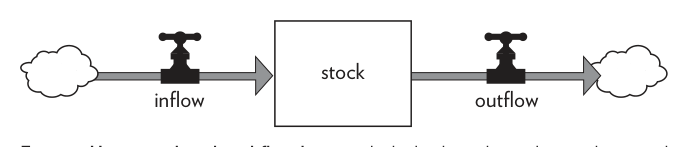

**Figure 2: A stock of minerals depleted by mining**
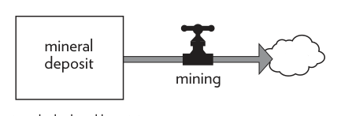

**Figure 3: A stock of water in a reservoir**
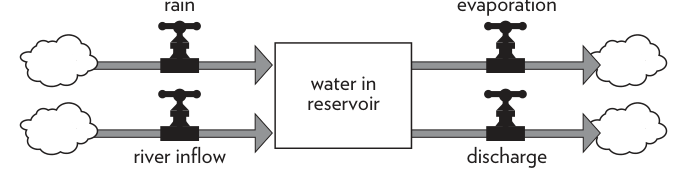

**Figure 4: A stock of lumber linked to a stock of trees**
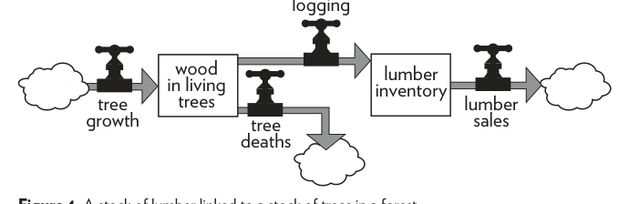

### The Bathtub Analogy
Imagine a bathtub.
*   **Stock:** Water in the tub.
*   **Inflow:** Faucet.
*   **Outflow:** Drain.

**Figure 5: The structure of a bathtub system**
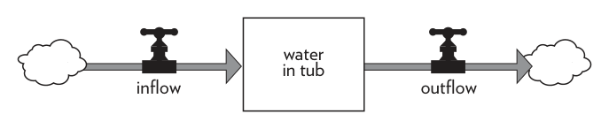

**Dynamic Equilibrium:**
If the inflow equals the outflow, the water level stays constant.
If the inflow is higher, the level rises.
If the outflow is higher, the level falls.

**Figure 6: Water level when the plug is pulled**
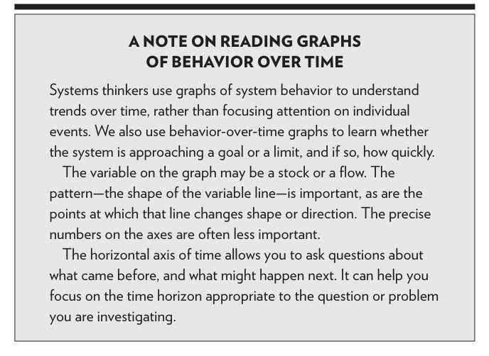

**Figure 7: Constant outflow, inflow turned on after 5 minutes**
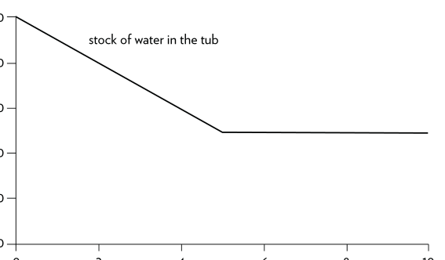

**Key Principles from the Bathtub Model:**
1.  **Control:** You can fill a bathtub by increasing the inflow **or** by decreasing the outflow. Similarly, you can increase energy security by finding new oil (inflow) or by burning less (outflow).
2.  **Sluggishness:** **Stocks usually change slowly.** They act as delays, buffers, and shock absorbers. This momentum means systems take time to change (e.g., it takes time for a forest to grow or for pollution to clear).
3.  **Independence:** Stocks allow inflows and outflows to be independent. You don't need to produce gasoline at the exact rate cars burn it; the stock in the tank buffers the difference.

## How the System Runs Itself—Feedback

When a stock stays within a range or grows/declines consistently, there is likely a control mechanism working through a **feedback loop**.
A feedback loop occurs when a change in a stock affects the flows into or out of that same stock.
*   **Bank Account:** Amount of money (stock) → Interest earned (flow) → More money.
*   **Checking Account:** Low cash (stock) → Decision to work more (flow) → More cash.

**Figure 8: How to read a stock-and-flow diagram with feedback loops**
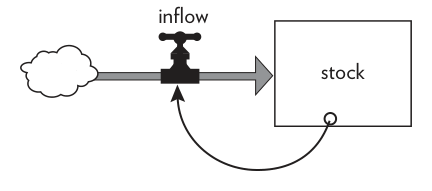

## Stabilizing Loops—Balancing Feedback

A **Balancing Feedback Loop (B)** tries to keep a stock at a goal level. It stabilizes the system.

**Example: Coffee Drinker**
*   **Goal:** Desired energy level.
*   **Stock:** Actual energy level.
*   **Action:** If actual level is low (discrepancy), you drink coffee to raise it. If actual level is too high, you stop drinking.

**Figure 9: Energy level of a coffee drinker**
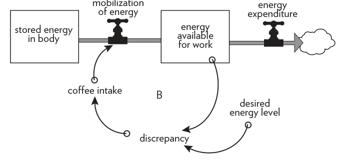

**Example: Coffee Cooling**
*   **Goal:** Room temperature.
*   **Behavior:** Hot coffee cools down; iced coffee warms up. The bigger the difference between the coffee and the room, the faster it changes.
*   **Function:** To bring the discrepancy to zero.

**Figure 10: A cup of coffee cooling or warming**
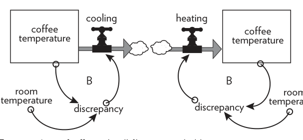

**Figure 11: Coffee temperature approaches room temperature**
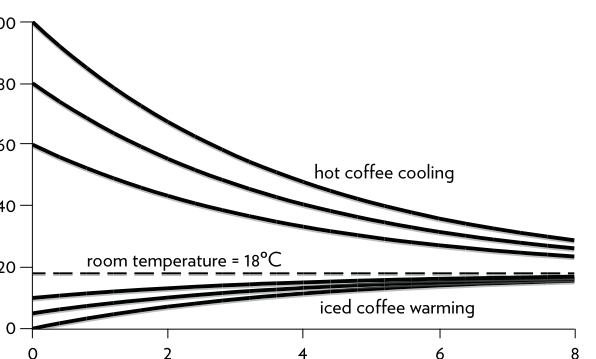

Balancing loops are goal-seeking. They account for stability in systems (e.g., thermostat, body temperature). However, feedback can fail if information is delayed, unclear, or if the action is too weak.

## Runaway Loops—Reinforcing Feedback

A **Reinforcing Feedback Loop (R)** is amplifying. It generates more input the more that is already there. It leads to exponential growth or runaway collapse.

**Examples:**
*   **Prices and Wages:** Prices go up → Wages go up → Prices go up more.
*   **Population:** More rabbits → More babies → More parents → Even more babies.
*   **Erosion:** Less soil → Fewer plants → More erosion → Even less soil.

**Figure 12: Interest-bearing bank account**
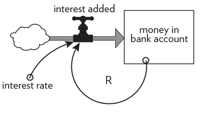

**Figure 13: Growth in savings with various interest rates**
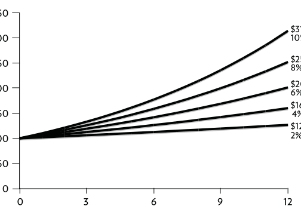

**Economic Growth:**
More capital → More output → More investment → More capital. This is the central engine of economic growth.

**Figure 14: Reinvestment in capital**
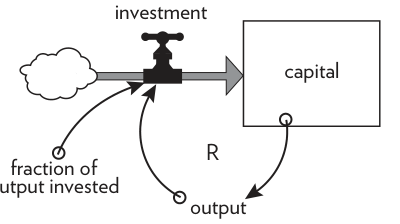

**Doubling Time:**
A shortcut to calculate how long it takes for an exponentially growing stock to double:
**Doubling Time = 70 ÷ Growth Rate (%)**
(e.g., An account with 7% interest doubles in 10 years).

**Figure 15: Hint on Reinforcing Loops and Doubling Time**
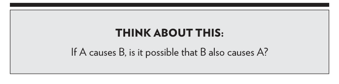

**Conclusion:**
Feedback loops are everywhere. A system creates its own behavior.
*   **Balancing loops (B)** stabilize.
*   **Reinforcing loops (R)** amplify.
Complex systems contain many linked loops tugging in different directions.

**Clarified Terms**
*   *Stock* – An accumulation of material or information that has built up over time (the "memory" of the system).
*   *Flow* – Material or information that enters or leaves a stock over a period of time.
*   *Dynamic Equilibrium* – A state where a stock's level remains constant because inflow equals outflow.
*   *Feedback Loop* – A mechanism where a change in a stock affects the flows into or out of it.
*   *Balancing Loop (B)* – A stabilizing feedback loop that seeks to maintain a goal or stock level.
*   *Reinforcing Loop (R)* – An amplifying feedback loop that leads to exponential growth or collapse.
